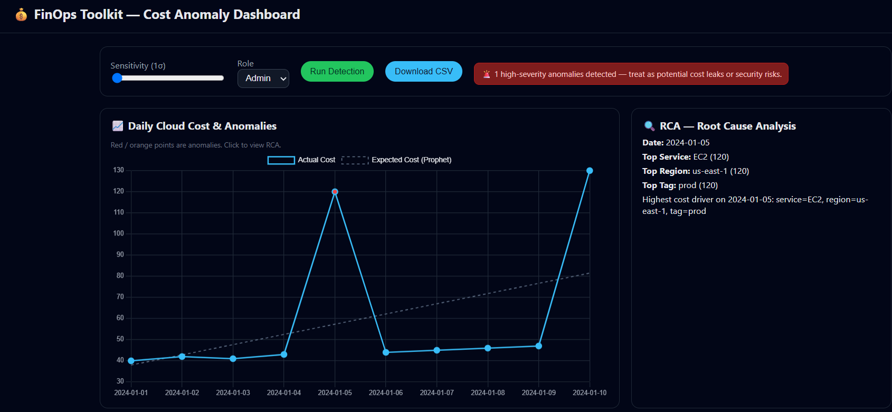
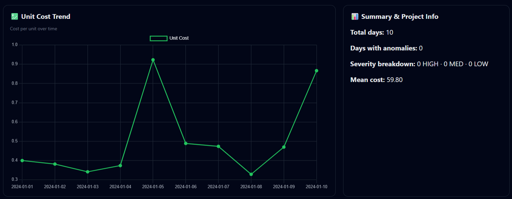
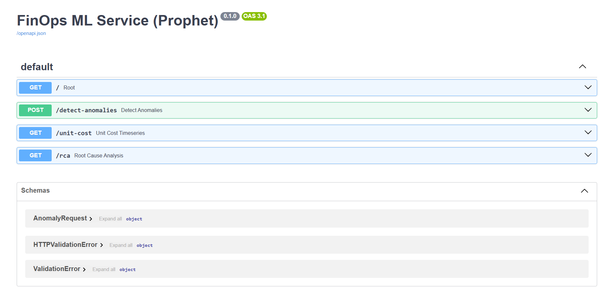
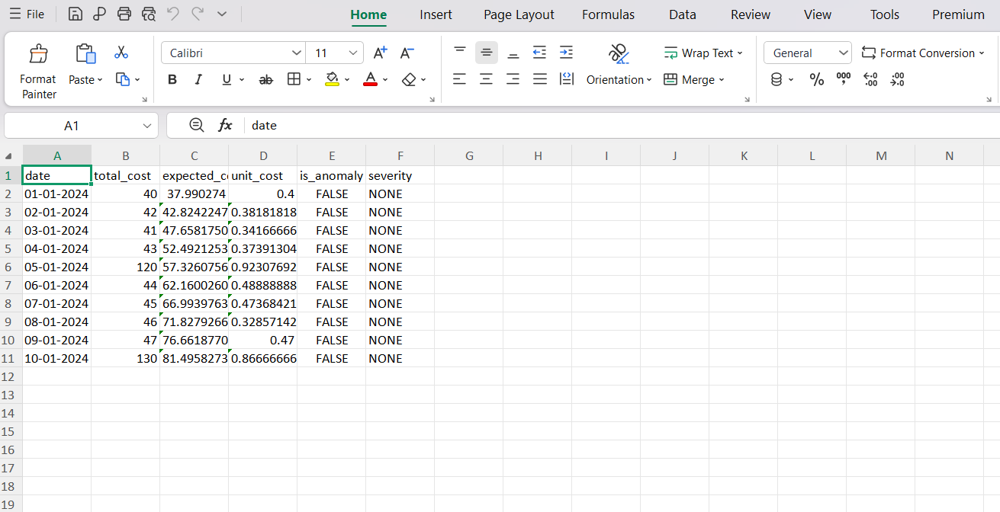
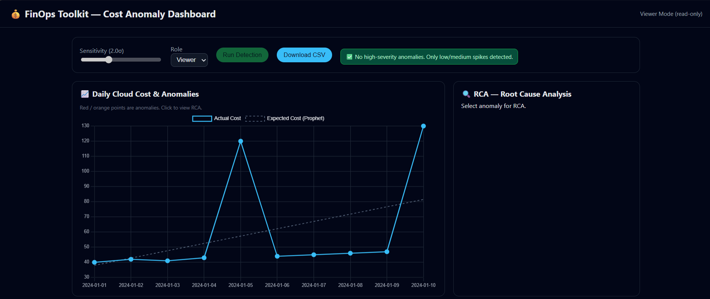

# 💰 FinOps Toolkit for Intelligent Cloud Cost Anomaly Detection

> An AI-powered FinOps dashboard that detects cloud cost anomalies using **Facebook Prophet**, performs **Root Cause Analysis (RCA)**, and provides interactive visualizations for cloud cost optimization.


🌐 **[Live Demo](https://finops-toolkit-frontend.onrender.com)**

---

## 📌 Overview

Cloud infrastructure costs often increase unexpectedly due to resource misconfigurations, traffic spikes, over-provisioning, or security incidents.

**FinOps Toolkit** is an intelligent cloud cost monitoring system that predicts expected cloud spending using **Facebook Prophet**, identifies abnormal cost spikes, performs **Root Cause Analysis (RCA)**, and presents insights through an interactive dashboard.

The application combines **Machine Learning**, **Cloud Cost Analytics**, and **FinOps principles** into a practical web application for cloud cost monitoring and optimization.

The application is deployed on **Render** with a FastAPI backend and interactive web dashboard, supporting live cloud cost analysis and CSV-based anomaly detection.

---

## ✨ Features

- 📈 Prophet-based cloud cost forecasting
- 🚨 Intelligent anomaly detection
- 🔍 Root Cause Analysis (Service, Region & Tags)
- 📊 Interactive dashboard using Chart.js
- 📉 Unit Cost Trend visualization
- 🎚 Adjustable anomaly sensitivity
- 🔐 Role-Based Access (Viewer/Admin)
- ⚠ Security alert banner for high-severity anomalies
- 📥 Export anomaly report as CSV
- 📤 Upload custom cloud cost CSV files for analysis
- 🌐 REST API using FastAPI

---

## 📷 Project Screenshots

### Dashboard Overview

Shows anomaly detection, expected vs actual cloud costs, and Root Cause Analysis (RCA).



---

### Analytics Dashboard

Displays unit cost trends and project summary statistics.



---

### FastAPI REST API

Swagger documentation for backend REST endpoints.



---

### CSV Export

Generated anomaly report exported as CSV.



---

### Viewer Mode

Dashboard displayed with Viewer role permissions.



---

## 🏗 System Architecture

```text
                HTML / CSS / JavaScript Dashboard
                           │
                           ▼
                  FastAPI REST Backend
                           │
                           ▼
            Facebook Prophet ML Engine
                           │
                           ▼
                 Cloud Cost CSV Dataset
🧠 Machine Learning

The anomaly detection engine uses Facebook Prophet to:

Learn cloud spending trends
Capture seasonal patterns
Forecast expected cloud costs
Detect abnormal spending spikes
Classify anomaly severity

Unlike traditional threshold-based monitoring, Prophet dynamically predicts expected cloud costs based on historical behavior.

📂 Project Structure
Finops-Toolkit
│
├── backend-java/
│
├── dashboard-frontend/
│   └── index.html
│
├── ml-service-python/
│   ├── ml_service.py
│   ├── cost-analysis.csv
│   └── requirements.txt
│
└── README.md
🛠 Tech Stack
Frontend
HTML5
CSS3
JavaScript
Chart.js
Backend
Python
FastAPI
Uvicorn
Machine Learning
Facebook Prophet
Pandas
NumPy
Deployment
Render (Backend & Frontend)
Tools
Git
GitHub
VS Code
📊 Dashboard Modules
Cost Trend Analysis

Visualizes daily cloud spending and expected spending predicted by Prophet.

Anomaly Detection

Highlights abnormal cloud cost spikes using ML forecasting.

Root Cause Analysis

Identifies:

Top Costly Service
Top Region
Top Resource Tag
Unit Cost Monitoring

Displays cost per business unit over time.

Security Alerts

Flags high-severity anomalies that may indicate:

Misconfigured resources
Unexpected scaling
Cost leaks
Suspicious cloud activity
CSV Analysis

Allows users to upload custom cloud cost CSV files and analyze them using the same anomaly detection pipeline.

🔐 Security Features
Role-Based Access Control (Viewer/Admin)
ML-based anomaly alerts
Security risk notifications
API-based architecture
Extendable authentication framework
📈 Future Enhancements
Docker containerization
Spring Boot API Gateway
JWT Authentication
API Key Security
Multi-cloud support (AWS, Azure & GCP)
Real-time billing integration
Email & Slack alerts
Cost optimization recommendations
🚀 Getting Started
Clone Repository
git clone https://github.com/Ishwari345/Finops-Toolkit.git
cd Finops-Toolkit
Install Dependencies
cd ml-service-python
pip install -r requirements.txt
Run Backend
uvicorn ml_service:app --reload --port 8000

The API will be available at:

http://127.0.0.1:8000

Swagger API documentation:

http://127.0.0.1:8000/docs
Launch Dashboard

Open:

dashboard-frontend/index.html

in your browser.

🎯 Project Objectives
Detect abnormal cloud spending
Reduce unnecessary cloud costs
Improve cloud financial visibility
Support FinOps decision-making
Demonstrate ML-driven cloud cost optimization
🌐 Live Application

Frontend:
https://finops-toolkit-frontend.onrender.com

Backend API:
https://finops-toolkit.onrender.com

API Documentation:
https://finops-toolkit.onrender.com/docs

👩‍💻 Author

Ishwari Bagewadi

GitHub: https://github.com/Ishwari345

🙏 Acknowledgements
Facebook Prophet
FastAPI
Chart.js
FinOps Foundation
Open Source Community
